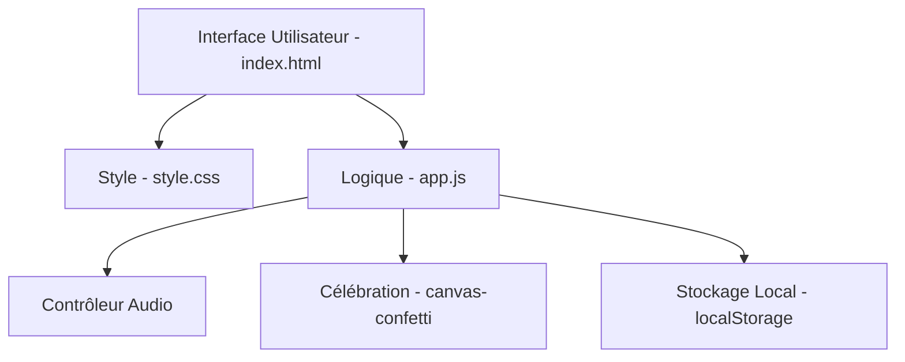

# System Patterns - Site Mémoire

## Architecture
Le projet est une application web monopage statique (SPA) ultra-rapide.

## Choix Techniques & Patrons de Conception
- **CSS Moderne** : Utilisation de variables CSS (custom properties) et de la notation de couleur OKLCH pour une gestion de thème précise et accessible.
- **Audio Autoplay Bypass** : Gestion de l'audio via un bouton de contrôle explicite (Play/Pause) pour respecter les politiques d'interdiction d'autoplay des navigateurs modernes.
- **State Management** : L'état des inscriptions est stocké dans le `localStorage` de l'utilisateur. Un panneau d'administration discret (accessible par un raccourci clavier ou un clic long sur un élément discret) permettra de télécharger la liste complète au format JSON/CSV.
- **Micro-animations (Design Spells)** : Transitions douces lors de la saisie des formulaires, retour haptique visuel sur les boutons, et explosion festive à la soumission.
